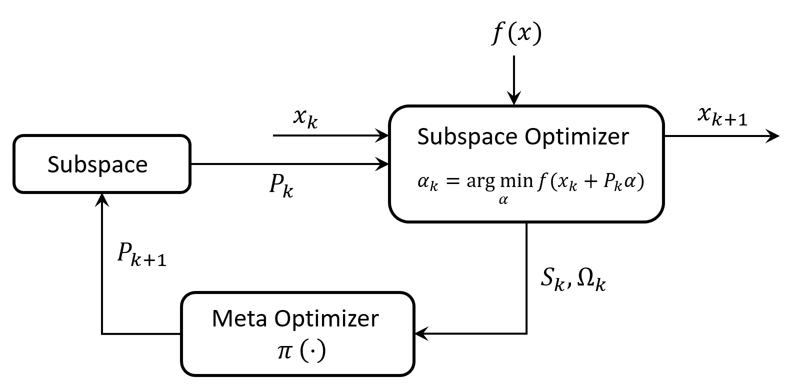

# Efficient Meta Subspace Optimization

This repository includes the code accompanying the submission to AutoML 2022 entitled "Efficient Meta Subspace Optimization".

<!--The code implements a meta optimizer inference which is applied to the subspace optimization paradigm, on the Robust Linear Regression as described in "Learning to Optimize", by Li and Malik (ICL 2017).-->

<!--The code runs three algorithms:-->

<!--- SESOP: The Sequential Subspace Optimization (SESOP) algorithm described in:  -->
<!--Narkiss, G. and Zibulevsky, M. (2005). Sequential subspace optimization method for large-scale-->
<!--unconstrained problems. Technical Report CCIT 559, Technion – Israel Institute of Technology, -->
<!--Faculty of Electrical Engineering.-->
<!--- RB: A Rule based algorithm described in Section 3.3 of the paper-->
<!--- MSO: The meta optimizer described in Algorithm 1 in the paper.-->

## Abstract
Subspace optimization methods have the attractive property of reducing large-scale optimization problems to a sequence of low-dimensional subspace optimization problems.
However, existing subspace optimization frameworks adopt a fixed update policy of the subspace, and therefore, appear to be sub-optimal.
In this paper we propose a new \emph{Meta Subspace Optimization} (MSO) framework for large-scale optimization problems, which allows to determine the subspace matrix at each optimization iteration. 
In order to remain invariant to the optimization problem's dimension, we design an \emph{efficient} meta optimizer based on very low-dimensional subspace optimization coefficients, inducing a rule-based method that can significantly improve performance. 
Finally, we design and analyze a reinforcement learning (RL) procedure based on the subspace optimization dynamics whose learnt policies outperform existing subspace optimization methods.

## Install
- Pytorch 1.10.2

## Results reproduction
To reproduce the performance of the main model of our paper on the Robust Linear Regression objective as described in "Learning to Optimize", by Li and Malik (ICLR 2017):

1. Run `python main.py`

The model should give a 30% improvement in convergence.

The Model repository contains the pretrained agent. Make sure to configure the script with the agent's pre-trained weights.

## License
This repository is released under the CC-BY-NC-SA 4.0. license as found in the LICENSE file.

<!--
Citation
--------
Please cite this work in your publications if it helps your research:

	@article{choukroun2021meta,
	  title={Meta Subspace Optimization},
	  author={Choukroun, Yoni and Katz, Michael},
	  journal={arXiv preprint arXiv:2110.14920},
	  year={2021}
	}
-->

